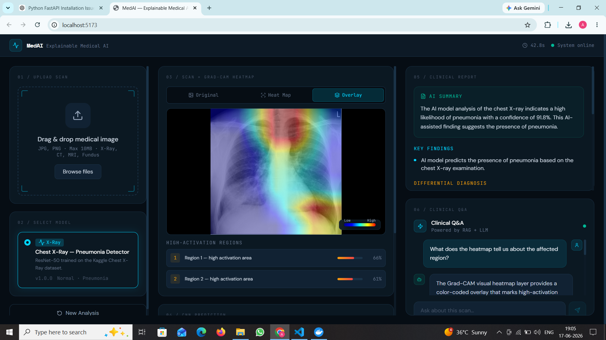
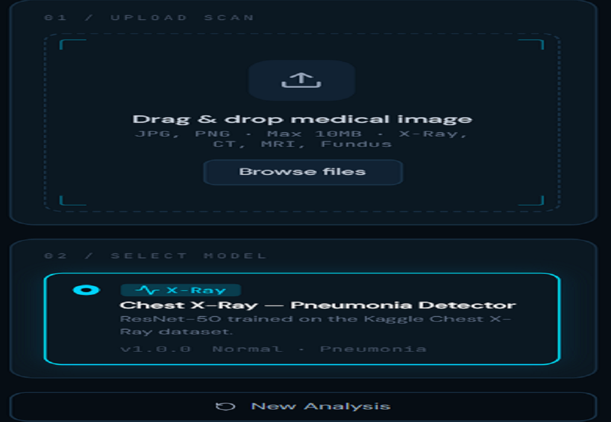
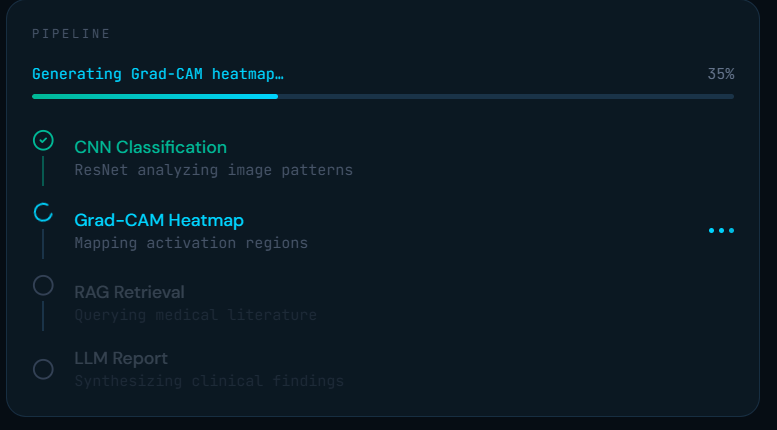
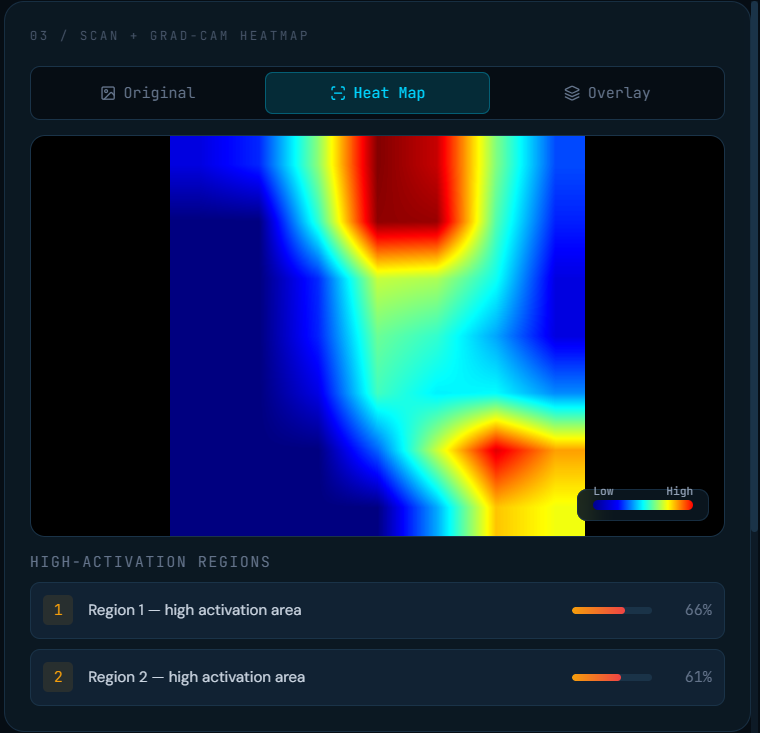
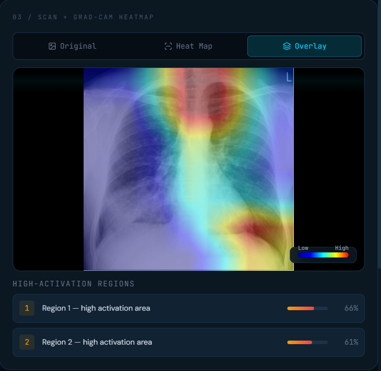
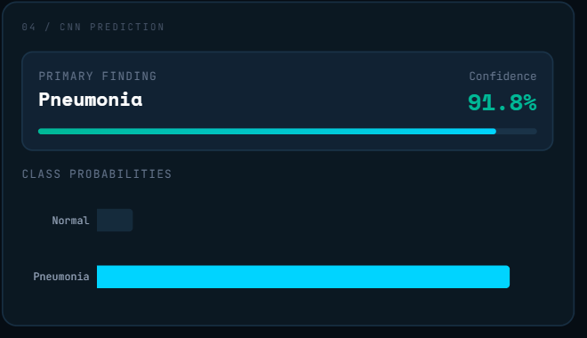
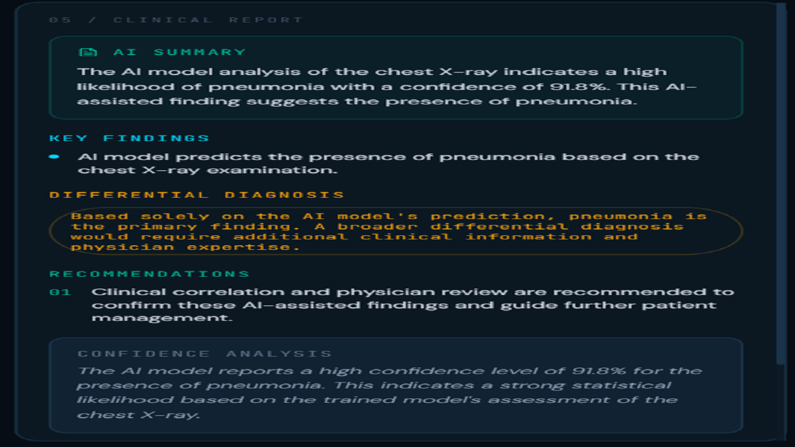
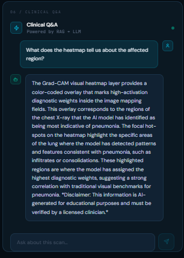

<div align="center">

# 🩺 MedAI — Explainable Healthcare AI System

**A production-grade, three-stage pipeline that turns a raw medical scan into a verified, explainable clinical report.**

`Upload Scan` → `CNN + Grad-CAM` → `RAG Retrieval` → `LLM Report` → `Real-time Q&A`

[](#)
[](#)
[](#)
[](#)
[](#)
[](#)
[](#)
[](#)

</div>

---

## Overview

MedAI doesn't just output a diagnosis — it **justifies** it. Every prediction is paired with a visual explanation (Grad-CAM), grounded in real clinical literature (RAG), and explained in plain language (LLM), so a physician can verify the AI's reasoning rather than trust it blindly.

<div align="center">


<sub><b>The full dashboard:</b> scan upload, pipeline status, Grad-CAM heatmap, prediction confidence, clinical report, and real-time chat — all in one view.</sub>
</div>

---

## How It Works

| Stage | What Happens |
|---|---|
| **1. Vision Engine** | A CNN (ResNet-50) classifies the scan, and Grad-CAM highlights *exactly which pixels* drove that decision. |
| **2. Knowledge Retrieval** | The predicted condition is used to query a vector database (ChromaDB) of medical journals and clinical protocols — no hallucinated advice. |
| **3. Reporting & Interaction** | An LLM (GPT-4o) synthesizes the CNN output + retrieved literature into a structured report, then answers physician follow-up questions live via Socket.io. |

---

## Screenshots

### Upload → Pipeline
<table>
<tr>
<td width="50%" align="center">

<br/><sub><b>Upload Scan</b></sub>
</td>
<td width="50%" align="center">

<br/><sub><b>Pipeline Progress</b></sub>
</td>
</tr>
</table>

### Grad-CAM Visualization
<table>
<tr>
<td width="50%" align="center">

<br/><sub><b>Grad-CAM Heatmap</b></sub>
</td>
<td width="50%" align="center">

<br/><sub><b>Heatmap Overlay</b></sub>
</td>
</tr>
</table>

### Diagnosis → Report
<table>
<tr>
<td width="50%" align="center">

<br/><sub><b>Prediction & Confidence</b></sub>
</td>
<td width="50%" align="center">

<br/><sub><b>Clinical Report</b></sub>
</td>
</tr>
</table>

### Real-Time Clinical Q&A
<div align="center">

<br/><sub><b>Grounded, real-time Q&A about the scan</b></sub>
</div>

---

## Architecture

```
┌─────────────────────────────────────────────────────────────────┐
│                        BROWSER (React)                          │
│  Upload Zone │ Heatmap Viewer │ Report Panel │ Real-time Chat   │
└──────────────────────────┬──────────────────────────────────────┘
                            │ HTTP + Socket.io
┌──────────────────────────▼──────────────────────────────────────┐
│                  BACKEND (Express + TypeScript)                 │
│  REST API │ Socket.io │ Model Registry │ Analysis Orchestrator  │
└──────┬───────────────────┬──────────────────────┬───────────────┘
       │                   │                       │
┌──────▼──────┐   ┌────────▼────────┐   ┌──────────▼─────────────┐
│   MongoDB   │   │    ChromaDB     │   │  Python Service        │
│  Sessions   │   │  Medical RAG    │   │  FastAPI + PyTorch     │
│  Chat Hist  │   │  Vector Store   │   │  CNN + Grad-CAM        │
└─────────────┘   └─────────────────┘   └───────────┬─────────────┘
                                                      │
                                          ┌───────────▼──────────┐
                                          │    OpenAI GPT-4o      │
                                          │  Report Generation    │
                                          │  Q&A Grounding         │
                                          └───────────────────────┘
```

---

## Tech Stack

| Layer | Technology |
|---|---|
| Frontend | React 18 · TypeScript · Vite · Tailwind CSS |
| Backend | Express.js · TypeScript · Socket.io |
| Database | MongoDB (sessions) · ChromaDB (vector store) |
| AI — Vision | PyTorch · ResNet-50 · Grad-CAM |
| AI — Retrieval | ChromaDB embeddings (RAG) |
| AI — Language | OpenAI GPT-4o |
| Deployment | Docker · Docker Compose |

---

## Quick Start

### Prerequisites
- Node.js 20+
- Python 3.11+
- MongoDB (local or Atlas)
- Docker + Docker Compose (optional, recommended)

### 1. Clone & Install

```bash
git clone <repo>
cd explainable-medical-ai
npm run install:all
```

### 2. Configure Environment

```bash
cp backend/.env.example backend/.env
# Edit backend/.env and add your OPENAI_API_KEY
```

### 3. Start Infrastructure

```bash
# MongoDB + ChromaDB via Docker
docker compose up mongodb chromadb -d

# Or run ChromaDB standalone
docker run -p 8000:8000 chromadb/chroma
```

### 4. Start All Services

```bash
npm run dev
```

| Service | URL |
|---|---|
| Frontend | http://localhost:5173 |
| Backend | http://localhost:5000 |
| Python Inference | http://localhost:8000 |

---

## Training the Model

### 1. Download the Dataset
Get the [Chest X-Ray Pneumonia dataset](https://www.kaggle.com/datasets/paultimothymooney/chest-xray-pneumonia) and extract it to `python-service/data/chest_xray/`:

```
data/chest_xray/
├── train/
│   ├── NORMAL/
│   └── PNEUMONIA/
├── val/
│   ├── NORMAL/
│   └── PNEUMONIA/
└── test/
    ├── NORMAL/
    └── PNEUMONIA/
```

### 2. Train

```bash
cd python-service
pip install -r requirements.txt
python train_xray.py --data_dir ./data/chest_xray --epochs 10
```

Weights are saved to `python-service/weights/xray_pneumonia_resnet50.pth`.
**Expected test accuracy: ~94–96%**

---

## Extending With New Models

The system is built to scale beyond X-rays. Adding a new model (e.g. diabetic retinopathy, histopathology) takes three steps:

**1. Python service** — `model_loader.py`
```python
"fundus-retinopathy-v1": {
    "architecture": "efficientnet_b4",
    "weights_path": "./weights/fundus_retinopathy_effnet.pth",
    ...
}
```

**2. Backend** — `modelRegistry.ts`
```typescript
{
  id: 'fundus-retinopathy-v1',
  isActive: true,   // ← flip this on
  ...
}
```

**3. RAG knowledge base** — `ragService.ts`
```typescript
{
  id: 'dr-grading-001',
  text: 'Grade 3 Diabetic Retinopathy...',
  modality: 'fundus_retina',
  source: 'AAO Preferred Practice Pattern',
}
```

The model selector, pipeline, and chat all pick it up automatically — no other code changes required.

---

## Project Structure

```
explainable-medical-ai/
├── backend/                       # Express + TypeScript API
│   └── src/
│       ├── types/                 # Shared type definitions
│       ├── models/                # Mongoose schemas + Model Registry
│       ├── services/
│       │   ├── analysisService.ts     # Pipeline orchestrator
│       │   ├── pythonBridge.ts        # CNN inference proxy
│       │   ├── ragService.ts          # ChromaDB retrieval
│       │   └── llmService.ts          # GPT-4o report + chat
│       ├── controllers/           # Route handlers
│       ├── routes/                # Express router
│       └── server.ts              # App entry + Socket.io
├── frontend/                      # React dashboard
│   └── src/
│       ├── components/            # UI components
│       ├── pages/                 # Dashboard page
│       ├── hooks/                 # useAnalysis hook
│       ├── services/              # API + Socket clients
│       └── types/                 # Frontend types
├── python-service/                # FastAPI inference service
│   ├── models/                    # Model loader + registry
│   ├── gradcam/                   # Grad-CAM implementation
│   ├── main.py                    # FastAPI app
│   ├── train_xray.py              # Training script
│   └── requirements.txt
├── screenshots/                   # README assets
└── docker-compose.yml
```

---

## API Reference

#### `POST /api/analysis/upload`
Upload a medical image and start analysis.
```jsonc
Body:    FormData { image: File, modelId: string }
Returns: 202 { message, data: { modelId, fileName } }
```

#### `GET /api/analysis/:sessionId`
Retrieve a completed analysis session.

#### `POST /api/analysis/:sessionId/chat`
Ask a follow-up question about a scan.
```jsonc
Body:    { question: string }
Returns: { answer: string, sources: RAGChunk[] }
```

#### `GET /api/models`
List all registered models (active + inactive).

### WebSocket Events

| Event | Direction | Payload |
|---|---|---|
| `join:session` | Client → Server | `sessionId` |
| `analysis:progress` | Server → Client | `{ status, message, percent }` |
| `analysis:complete` | Server → Client | `AnalysisResult` |
| `chat:message` | Client → Server | `{ sessionId, question }` |
| `chat:response` | Server → Client | `{ answer, sources }` |

---

## Disclaimer

This system is a research and educational tool. All AI-generated analyses **must be reviewed by a qualified medical professional** before any clinical use. It is not a certified diagnostic device.

---

<div align="center">
<sub>Built with React, Express, FastAPI, PyTorch, and OpenAI.</sub>
</div>
